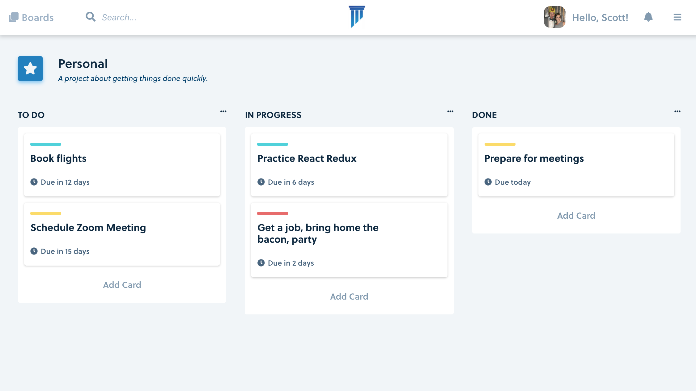

[Click here for a live demo](https://distracted-albattani-392454.netlify.app)

  

## Task Manager (Trello Clone)

A fun little side project working with React, Redux, and Jest Unit Testing! :)

## App Architecture

1. Divide React components into Container and Presentational components.

It’s common practice to separate the type of components into components that manage the state of your application and components focusing on how your app looks (presentation).

This is more of an “art” than a “science”. As you are building your application, you will realize too many props are merely being forwarded. This might be a good time to introduce some container components.

2. Improve the development experience using styled components

As an Engineer, I’ve been told to separate concerns and place things within their own files since beginning to learn how to code (i.e. Markup in .html files, styles in .css/.scss files, logic in .js files). This makes sense however, within the last couple of years we have seen a surge of “component-based” architectures for modern day applications. The need to separate our markup/styles/logic has become less of an issue.

With React Styled Components there are many benefits. First, you get the immediate benefit of scoped styles. This is one of the main challenges working with CSS. Unknowingly a change in a style class affects another component style unrelated somewhere else in the DOM. Styled Components ensure your properties are tied directly to your single component.

Additionally, working with dynamic styles becomes easier. Since these are Styled Components we get the benefit of passing in attributes via props to our styles and can change the state of our application styles relatively easily.

Lastly, you get to enjoy using nesting similar to SCSS and LESS. This makes writing styles more enjoyable as it removes the need to write additional classes and keeps things focused within the styled-group.

## Opinions

The goal of this project is to work with React, Redux, and Jest. My time at Mediafly focused heavily using Angular+TypeScript. I wanted to compare the 2 different popular frameworks. Here are a few of my opinions working with React.

Writing a web application in React is a great experience compared to Angular. Part of this is the ability to write components within function declarations as opposed to class-style components. Yes, you could write React components using class-style syntax but with React Hooks there is no need. Additionally, writing in JSX is enjoyable. I remember when it was considered taboo to not mix markup and logic into the same files, however the experience is great because it means one less file to toggle between. Also, React Hooks is fantastic and feels like a cheat code when managing state.

Redux does have its advantages and disadvantages. Advantages being its use of a single store object and immutability. The two reasons why I enjoy immutability is it solves the problem of object equality and forces you to explicitly express your values as "clones" or "copies" through the use of reducers (pure functions). This is achieved by taking advantage of latest JS syntax like the spread operator `{...myObj, {color: red} }` is fantastic combined with the ability to override properties. Also, pure functions makes unit testing a breeze!

However, Redux does lend itself some disadvantages primarily through initial configuration setup. It's not bad once you get it up and running but remembering each function and ensuring container components are in place is something to always think about. Also, as an Engineer you have to decide which state you do want to end up managing through Redux and which through React Hooks. Generally, I prefer to store state in Redux if I know the state is going to be used across multiple components. If it's not, React Hooks are just fine. There is no need to automatically default to using Redux for everything.

Lastly, I wanted this project to experience writing unit tests in Jest. I've always heard positive experiences writing in the testing framework and yes I can confirm, the experience is great. Snapshot testing a great quick tool for regression testing. Initially, I assumed these could be used for every little component and can move on with our lives, but I disagree. Snapshot testing has its place but there is something to be said about having explicit written tests. Tests not only ensure code works as expected but defines the feature requirements. To an Engineer, reading those requirements gives me a strong satisfaction that the most important points are working.

## What else

I've been playing around with the Redux architecture. Initially, I kept my components within a separate "redux" folder and files sorted by functionality next to a "components" folder. However after quickly using redux, I do not enjoy this approach because you constantly have to reference your imports from multiple files. Instead I prefer to place my redux files next to each feature. While this couples your components and state management, I find it's more enjoyable and more scalable once your project becomes larger.

I came across the idea of putting your redux logic within "ducks". Essentially, all your actions, action creators, reducers all in one file. This goes against the grain of convention but why not try something new, right? ;)
